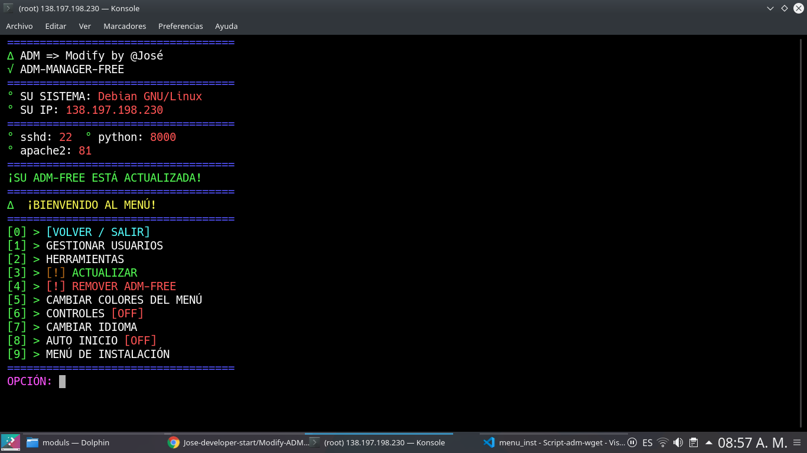

<h2>Administrador de VPS => PROXYS SOCKS, SSH, SQUID, ETC</h2>

<h3>Instalacíon</h3>

Funcional en Debian 10 y ubuntu 16

apt-get update; apt-get upgrade -y; wget https://raw.githubusercontent.com/Jose-developer-start/Modify-ADM/main/instala.sh; chmod +x ./instala.sh; ./instala.sh

 

